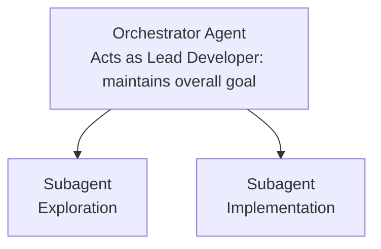

# Subagents & Codebase Exploration: Day 1 Fundamentals

## 1. The Core Challenge: Statelessness in Codebase Exploration

Of all the constraints encountered when working with Large Language Models (LLMs), **statelessness** is the most onerous and fundamental.

- **Zero-Memory Start:** Every time an LLM is dropped into a codebase, it starts with zero memory of any prior exploration. It has to orient itself from scratch every single session.
- **The Foundational Skill:** Because of this statelessness, learning how to guide an agent to explore a codebase effectively is a foundational skill required to successfully build features with coding tools.
- **The Token Trade-off:** There is a direct tension between exploration and implementation.
  - Exhaustive codebase exploration consumes massive amounts of tokens.
  - The more tokens spent on exploration, the fewer tokens remain in the "Smart Zone" (the optimal performance window of the context) for actual code implementation.
  - Conversely, failing to explore adequately leads to a poorly informed model, resulting in substandard code implementation.

---

## 2. The Solution: Subagents as a Context-Saving Mechanism

To bridge this divide, modern coding platforms like **Claude Code** implement a delegation system based on **subagents**.

- **Delegation Mechanism:** The main agent (the Orchestrator) acts like a lead developer, spawning separate subagents to handle specific tasks.
- **Independent Context Windows:** Spawning a subagent creates a completely new, isolated context window.
- **The "Junior Developer" Loop:**
  1. The Orchestrator prompts the subagent to perform a specific task (e.g., explore a repository feature).
  2. The subagent executes the task, spending its own context budget inside its own "Smart Zone".
  3. Once complete, the subagent returns a concise summary of its findings back to the Orchestrator.
- **Key Efficiencies:**
  - **Parallelism:** The Orchestrator can spin up multiple subagents to perform tasks in parallel.
  - **Cost & Speed Optimization:** Subagents can be initialized with different system prompts and run on smaller, faster, and cheaper models (such as Claude Haiku) optimized for simple exploration.

---

## 3. Practical Codebase Exploration: Triggering Subagents

Under the hood, Claude Code uses subagents aggressively, but their activation depends heavily on how the user prompts the Orchestrator.

### Standard Informational Queries vs. In-Depth Exploration

In practice, the way you frame your prompt determines whether Claude Code delegates to a subagent or attempts to answer the query directly:

| Query Type             | Typical Prompt                                                                    | Agent Behavior                                                                        | Result                                                                                                                                         |
| :--------------------- | :-------------------------------------------------------------------------------- | :------------------------------------------------------------------------------------ | :--------------------------------------------------------------------------------------------------------------------------------------------- |
| **Direct Request**     | _"Tell me what the tech stack of this repo is and what its intended purpose is."_ | **No subagents spawned.** The Orchestrator queries files directly.                    | **Shallow search.** Only a handful of files are read (e.g., 6 files), resulting in a brief summary without a deep dive.                        |
| **Exploration Prompt** | _"Explore how PP works in this repo."_                                            | **Subagent spawned.** Spawns an `[explore]` subagent with a customized system prompt. | **Deep search.** Very aggressive tool calling (e.g., 25 tool calls, 64,000 tokens, 32% of its context window), producing an in-depth analysis. |

### Prompting Takeaway: Word Choice Matters

To trigger a highly thorough codebase exploration, **explicitly use the verb "explore"** in your prompt. This word connects with the agent's latent space, triggering the Orchestrator to deploy a dedicated exploration subagent rather than performing a standard, shallow search.
